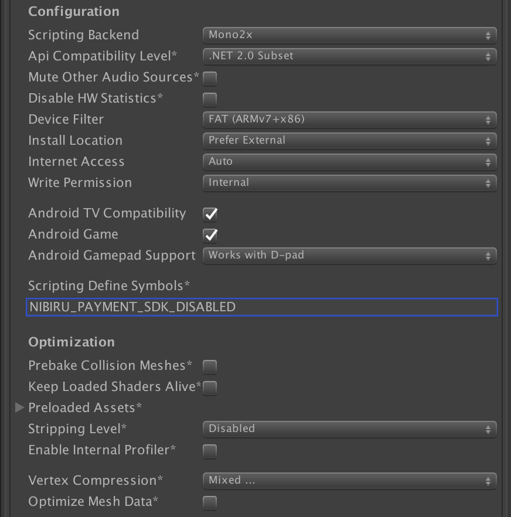

# Disabling the Payment SDK

> If you have followed the instructions for [Working with the current user](nibiru-sdk-user-management.md) or [Selling your app & payment SDK](nibiru-payment-sdk.md) you need to disable the payment SDK before <a href="https://users.wearvr.com/developers/devices/nibiru/test-builds" target="_blank">submitting a test build</a>.

Open the Unity **Edit** menu.

Select **Project Settings** and then **Player**.

In the Inspector, under **Other Settings**, enter *NIBIRU_PAYMENT_SDK_DISABLED* in the **Scripting Define Symbols*** field.

<p align="center">
  
</p>

This disables the payment code you should have previously placed within the following C# preprocessor directive in [Working with the current user](nibiru-sdk-user-management.md) or [Selling your app & payment SDK](nibiru-payment-sdk.md):

```cs
public class NibiruPayment : MonoBehaviour
# if !NIBIRU_PAYMENT_SDK_DISABLED
	// User and payment API code
#endif
}
```
## Enabling the Payment SDK

If you are submitting a [release build](https://users.wearvr.com/apps), then you need to make sure *NIBIRU_PAYMENT_SDK_DISABLED* does **NOT** appear in the **Scripting Define Symbols*** field.

## Next: Optimization

It's time to [submit your VR experience](/Readme.md#uploading-and-selling-your-experiences).
