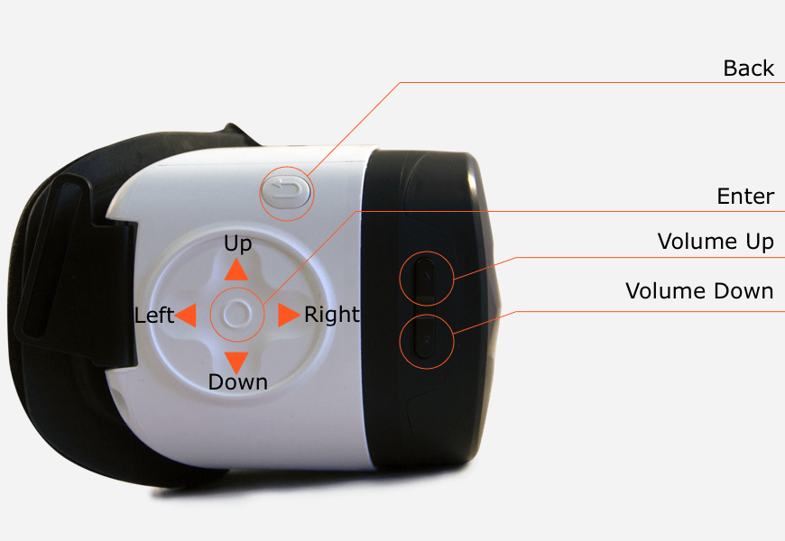

# Nibiru headset buttons

Once you have [installed the Nibiru VR Unity SDK](/docs/nibiru-vr-unity-sdk-installation.md), you can begin to bind to button events from the headset.

## Headset buttons

Nibiru headsets provides basic gaze-based pointer input and some additional buttons for operating system functionality.

<p align="center">
  
</p>

### Binding to headset buttons

To define behaviour for any of Nibiru headsets’ buttons, create a new script that implements the `Assets/NVR/Scripts/UI/INvrButtonListener` interface.

Attach the script as a component to any GameObject in your scene and the methods it implements will be called whenever the corresponding headset’s buttons are pressed.

#### OnPressEnter

Called in the first frame after a user’s finger is lifted off the touch pad and then in the frame that follows.

```cs
void OnPressEnter(bool isKeyUp)
```

##### Parameters

| Parameter | Description |
|:---|:---|
| `isKeyUp` | true in the first frame after the user’s finger is lifted off the touch pad.false in the frame after. |


##### Example

```cs
public class GameObjectConcreteButtonHandler : MonoBehaviour, INvrButtonListener {

  public void OnPressEnter(bool isKeyUp) {
    if (isKeyUp) {
      // Finger has just been lifted off the touchpad
    } else {
      // Finger was lifted off the touchpad in the previous frame
    }
  }

}
```

#### OnPressLeft

Called in the first frame after a user’s finger leaves the touch pad at the end of a swipe left gesture.

Despite the method’s name, this is primarily a swipe gesture.

```cs
void OnPressLeft()
```

#### OnPressRight

Called in the first frame after a user’s finger leaves the touch pad at the end of a swipe right gesture.

Despite the method’s name, this is primarily a swipe gesture.

```cs
void OnPressRight()
```

#### OnPressUp

Called in the first frame after a user’s finger leaves the touch pad at the end of a swipe up gesture.

Despite the method’s name, this is primarily a swipe gesture.

```cs
void OnPressUp()
```

#### OnPressDown

Called in the first frame after a user’s finger leaves the touch pad at the end of a swipe down gesture.


Despite the method’s name, this is primarily a swipe gesture.

```cs
void OnPressDown()
```

#### OnPressVolumnUp (sic)

Called in the first frame in the volume up button is pressed.

```cs
void OnPressVolumnUp()
```

#### OnPressVolumnDown (sic)

Called in the first frame in the volume down button is pressed.

```cs
void OnPressVolumnDown()
```

### The back button

Nibiru requires that you manually bind the exit handler for when the user presses the back button on the headset. This should always close the current application to remain consistent with how the rest of the operating system behaves.

> It is a Nibiru requirement that all VR apps implement this behaviour.

This is done by implementing the `INvrButtonListener` interface and defining the OnPressBack method:

```cs
public class ExitApplication : MonoBehaviour, INvrButtonListener {

  public void OnPressBack()
  {
    /* Teardown should be done here */
    Application.Quit();
  }
}
```

### Next: Enabling developer mode

If you have a development kit, see [Enabling USB debugging](/docs/nibiru-developer-mode-usb-debugging.md)

If you do not have a development kit, but want to sell your VR experience on the Nibiru store see [Working with the current user](/docs/nibiru-sdk-user-management).

Otherwise, move on to [Performance optimization](/docs/optimizing-nibiru-experiences.md).
