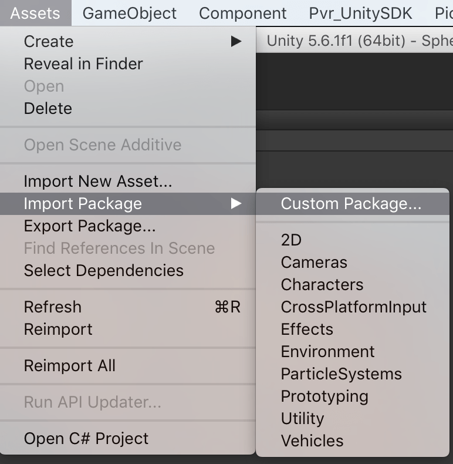

# Nibiru user management

The Nibiru Payment SDK provides the ability to integrate with Nibiru’s payment and user management infrastructure.

You should have already [integrated the Nibiru VR SDK](/docs/nibiru-vr-unity-sdk-installation.md) into your project before attempting these instructions.

## Importing the unitypackage

The Nibiru Unity user and payment SDK comes as a .unitypackage that you can import into your project.

Download the [Nibiru Payment SDK](https://users.wearvr.com/developers/devices/nibiru/resources/payment-unity-package) and import it via the **Assets › Import Package › Custom Package...** menu option in Unity.

<p align="center">
  
</p>

Download the [`data.bin` file](https://users.wearvr.com/developers/devices/nibiru/resources/data-bin) and add it to the `Plugins/Android/assets` directory.

This allows your app to be distributed through WEARVR on the Nibiru platform.

> The `data.bin` filename must be all in lowercase.

## Integrate the SDK

Modify an existing script (or create a new one) attached as a component to a GameObject in your scene and add the following code:

```cs
public class NibiruPayment : MonoBehaviour
# if !NIBIRU_PAYMENT_SDK_DISABLED

	void Start () {

		NPVRAndroid.init ();

		// You will need to add further code here, depending on your circumstances (see below)

		NPVRAndroid.enableLog (true);
		NPVRAndroid.onStart ();
	}

	void OnApplicationPause()
	{
		NPVRAndroid.onPause ();
	}

	void OnApplicationQuit()
	{
		NPVRAndroid.onStop ();
	}
#endif
}
```

## Logging the user in

To display the Nibiru login interface:

```cs
NPVRAndroid.loginUI();
```

To receive the result of the login, define a onNPVRLogin() method on the same script.

```cs
onNPVRLogin(string result);
```

Where `result` is a string containing a comma-separated list of parameters that describe the result of the log in request. They are, in order:

| Parameter | Description |
| :--- | :--- |
| `status` | A status code describing the result of the payment request. Refer to [Session statuses](#session-statuses) below. |
| `uid` | The user’s unique id |
| `token` | The user token |
| `name` | The user’s name |

#### Example

```cs
void onNPVRLogin(string result){
	string[] resultParams = result.Split (new string[]{","}, System.StringSplitOptions.None);

	int status = int.Parse (result[0]);
	long uid = long.Parse (result[1]);
	string token = result[2];
	string name = result[3];
}
```

#### Session statuses

| `NPVRAccount.STATE_*` | Value | Description |
| :--- | :---: | :--- |
| STATE_LOGIN_SUCC | 0 | Login successful |
| STATE_LOGIN_WRONG_PASS | 1 | The user provided an incorrect password |
| STATE_LOGIN_NO_USER | 2 | The user provided an invalid username |
| STATE_LOGIN_FAILED | 3 | The authentication failed |
| STATE_NETWORK_ERROR | -2 | The login failed due to a network error |
| STATE_INVALID_PARA | -1 | The login failed because of an invalid parameter was provided |
| STATE_USER_CANCEL | 1024 | The user cancelled the login attempt |


## Getting the current user session

Once the user has logged in, you can retrieve the session details at any time using `NPVRAndroid.getNPVRAccount()`.

```cs
NPVRAndroid.getNPVRAccount ();
```

`NPVRAndroid.getNPVRAccount()` returns `null` if the user is not logged in, otherwise it returns a string containing a comma-separated list of user session parameters.

| Parameter | Description |
| :--- | :--- |
| `uid` | The user’s unique id |
| `token` | The user token |
| `name` | The user’s name |

#### Example

```cs
string result = getNPVRAccount ();

string[] resultParams = result.Split (new string[]{","}, System.StringSplitOptions.None);

long uid = long.Parse (result[0]);
string token = result[1];
string name = result[2];
```

## Logging the user out

To display the Nibiru log out interface:

```cs
NPVRAndroid.logout();
```

To receive the result of the logging the user out, define a `onNPVRLogout()` method on the same script.

```cs
onNPVRLogout(string status);
```

Where `status` is a status code describing the result of the payment request. Refer to [Log out statuses](#log-out-statuses) below.

#### Example

```cs
void onNPVRLogout(string result){
	int status = int.Parse (result);
}
```

#### Log out statuses

| `NPVRAccount.STATE_*` | Value | Description |
| :--- | :---: | :--- |
| STATE_LOGOUT_SUCC | 30 | Log out successful |
| STATE_LOGOUT_FAILED | 31 | The log out request failed |
| STATE_LOGOUT_ALREADY | 32 | The user is already logged out |

## Next

If you are submitting a test build, you need to [disable the payment SDK](/docs/disabling-payment-sdk.md).

If you wish to sell your app, you will need to [integrate with the payment SDK](/docs/nibiru-payment-sdk.md).
