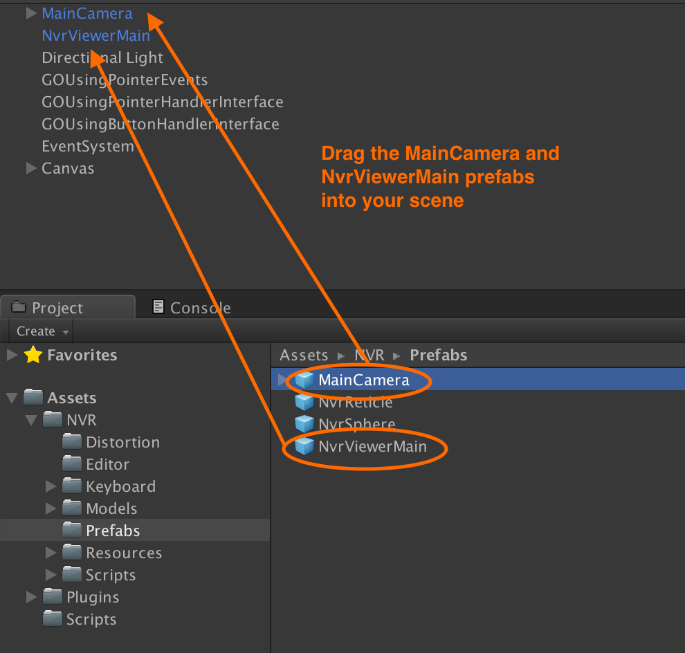
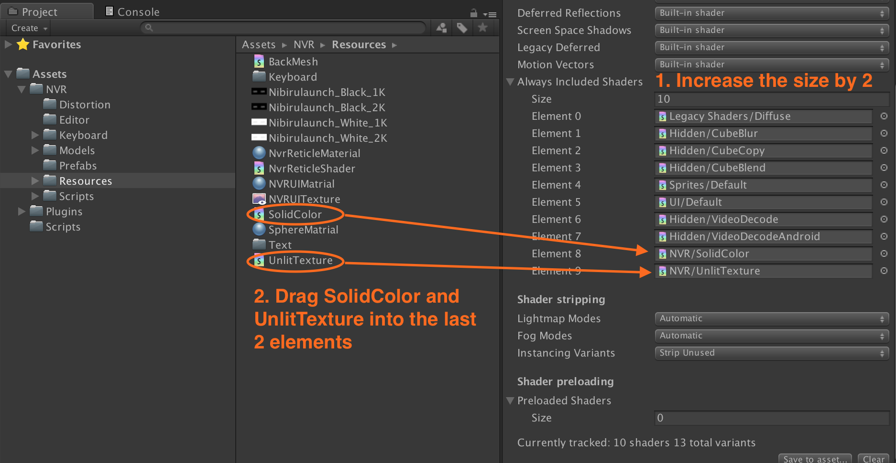
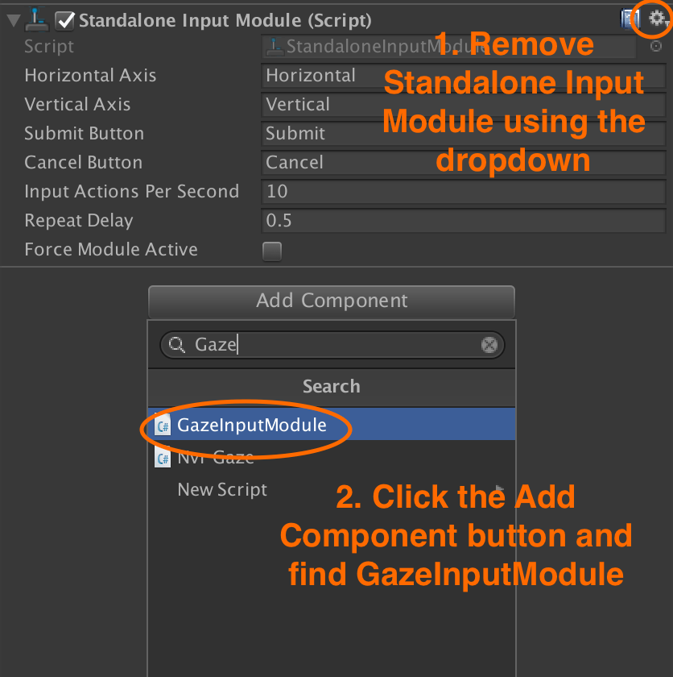
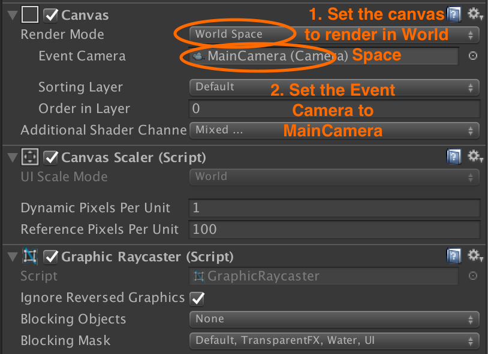
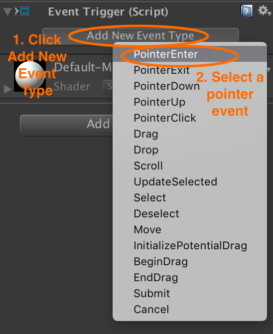
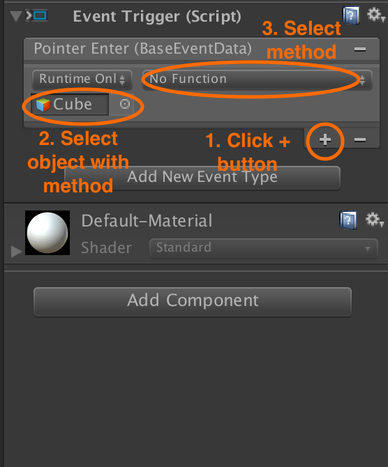

# Nibiru Unity SDK camera setup

Remove any existing `MainCamera` or equivalent from your scene and drag the prefab `Assets/NVR/Prefabs/MainCamera` in to replace it. The camera provides the user viewpoint and the ability to target other objects in the scene by looking at them.

Drag the prefab `Assets/NVR/Prefabs/NvrViewerMain` into your project’s scene.

<p align="center">
  
</p>

Open **Edit › Project Settings › Graphics** and scroll to **Always Included Shaders** and add the `SolidColor` and `UnlitTexture` from `Assets/NVR/Resources`. The stereo rendering functionality relies on these two shaders at runtime, so they must be explicitly included.

<p align="center">
  
</p>

## Nibiru camera controls

The `NvrViewer` component simulates head tracking and a number of related features in the Unity player.

It provides the following controls when running your experience within Unity:

* Holding **alt + moving the mouse** simulates the user turning their head
* Holding **ctrl + moving the mouse** simulates the user tilting their head

## EventSystem setup

Add an `EventSystem` to your scene if it does not already have one and attach the `Assets/NVR/Scripts/GazeInputModule` script as a component.

Remove the **Standalone Input Module** and **Touch Input Module** from the `EventSystem` component as they will not be used and may interfere with the `GazeInputModule`.

<p align="center">
  
</p>

## Raycaster setup

Add a `Canvas` to your scene if you do not already have one.

Configure the `Canvas` to render in **World Space**.

Set the **Event Camera** to the `MainCamera` you added to your scene earlier.

<p align="center">
  
</p>

> Use a Canvas Pos Z value of 4 or more to achieve accurate focusing.

## Pointer input

The Nibiru VR SDK adapts the motion of the headset and presses of the trackpad’s middle button to Unity’s `Pointer*` events. This means you can attach handlers for these events in one of the usual ways:

* Attach an `EventTrigger` with one or more `Pointer*` events
* Attach a script that implements one or more of the [Unity pointer handler interfaces](https://docs.unity3d.com/ScriptReference/EventSystems.IPointerClickHandler.html).

### Using an EventTrigger

Using an `EventTrigger` on your UI component or `GameObject` is the simplest way of responding to gaze-based events and show normally be the preferred method.

Add an `EventTrigger` to your UI component or GameObject.

<p align="center">
  
</p>

Add an event type and select the pointer, drag or scroll event you want to trigger a method.

<p align="center">
  
</p>

If you want to call a method on a script on the current object, add it by dragging it onto your UI component or `GameObject` or by using the **Add Component** button.

Select the object and method you want to call when the event is triggered.

<p align="center">
  
</p>

### Using a pointer handler interface

For greater flexibility, you can use a script that implements one or more of the [Unity pointer handler interfaces](https://docs.unity3d.com/ScriptReference/EventSystems.IPointerClickHandler.html) and attach it to your UI component or GameObject.

For example, a script that responds to when the center button is pressed on the headset has the following structure:

```cs
public class CanvasComponent : MonoBehaviour, IPointerClickHandler
  {
      void OnPointerClick(PointerEventData eventData)
      {

      }
  }
```

Either drag your script onto your UI component or GameObject to add it as a component, or use the **Add Component** button and search for it.

## Reticle configuration

The `MainCamera` prefab automatically includes the `Assets/NVR/Scripts/UI/NvrReticle`, which draws a circle at the center of wherever the user is looking. It expands when the user looks at anything clickable.

If you chose to configure an existing `MainCamera` rather than use the prefab included in the SDK, you will need to drag `Assets/NVR/Scripts/UI/NvrReticle` into your scene as a child of `MainCamera` so it follows its movements.

It’s possible to override the normal behaviour of the reticle through the `NvrViewer.Instance.GazeApi` interface.

Hide:

```cs
NvrViewer.Instance.GazeApi(GazeTag.Hide, "");
```

Show:

```cs
NvrViewer.Instance.GazeApi(GazeTag.Show, "");
```

Size (Original, Large, Medium, Small):

```cs
NvrViewer.Instance.GazeApi(GazeTag.Set_Size,((int)GazeSize.Large).ToString());
```

Color (RGB range: 0-1):

```cs
NvrViewer.Instance.GazeApi(GazeTag.Set_Color, "0.043f_0.435f_0.043f");
```

Depth of field:

```cs
NvrViewer.Instance.GazeApi(GazeTag.Set_Distance, "0.5");
```

### Next: Binding to headset buttons

See [Nibiru headset buttons](/docs/nibiru-buttons.md).
