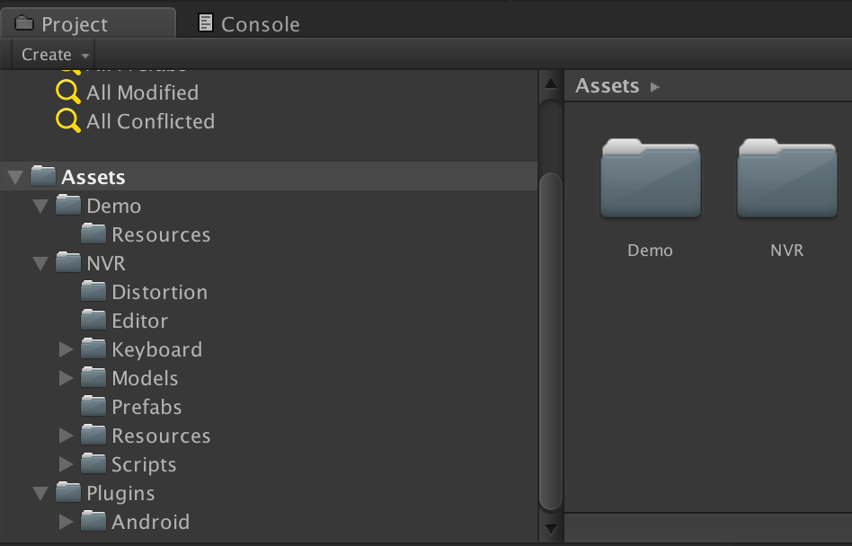
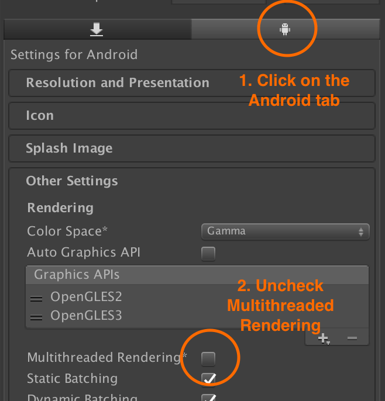
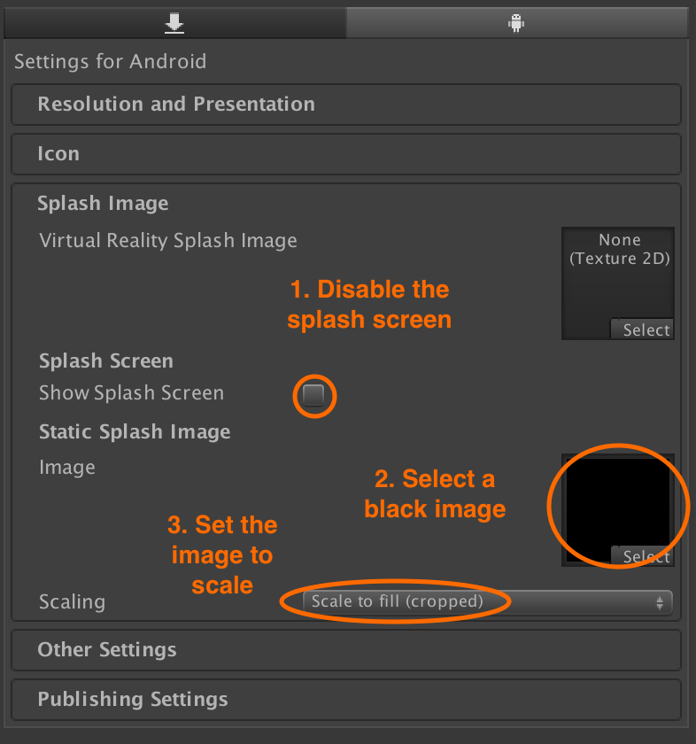
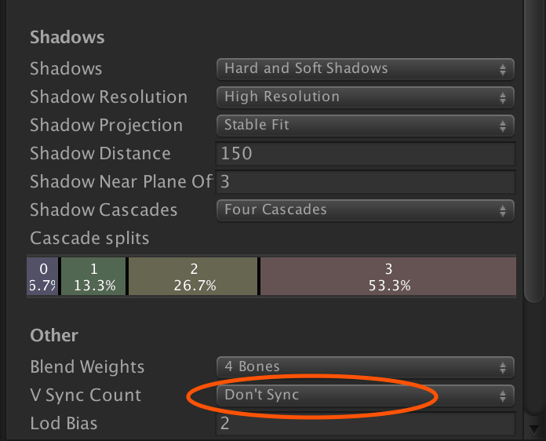

# Nibiru VR Unity SDK Installation

## Download the Nibiru VR Unity SDK

You can [download the Nibiru VR Unity SDK](https://users.wearvr.com/developers/devices/nibiru/resources/vr-unity-package) from WEARVR. You will be asked to create or sign into your developer account.

## Importing the unitypackage

The Nibiru Unity VR SDK comes as a .unitypackage that you can import into your project via the **Assets › Import Package › Custom Package...** menu option in Unity.

  

This will add a number of directories to your project:

  

## Project settings

### Disable multi-threaded rendering

Open **Edit › Project Settings › Player**. In the Android tab, uncheck **Multithreaded Rendering**

  

### Disable the splash screen

As the VR cameras only initialise after the splash screen has been displayed, the splash image does not display correctly in the headset.

If you are using the premium version of Unity, it is recommended to disable the splash screen and set the static splash image to a solid black image in **Project Settings**.

  

### Disable bundled Unity VR SDKs

Depending on the version of Unity you are using, the **Virtual Reality Supported** option can be found in **Other Settings** or **XR Settings**. Make sure it is **NOT** checked to avoid conflicts with the Nibiru VR SDK.

  

## Quality Settings

Open **Edit › Project Settings › Quality** and change the following settings:

### Turn off vertical sync

When using Unity 5.4 or higher in the **Other** section, change **V sync Count** to **Don’t Sync**

  

### Next: Camera setup and input

See [Camera & input module setup](/docs/nibiru-vr-camera-setup.md)
